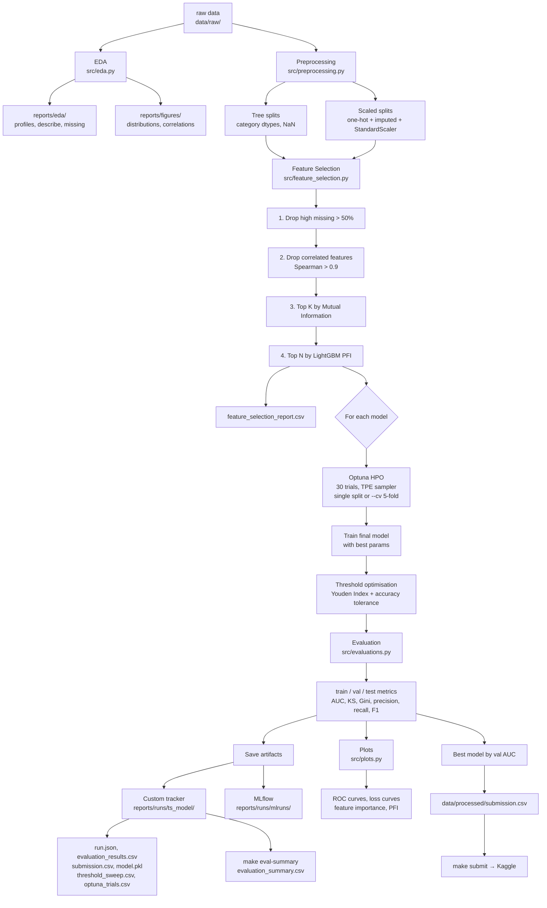

# kaggle-advanced-ml-course-bbva

Binary classification competition — predict whether a bank client will subscribe to a term deposit after a marketing campaign.

**Competition**: `aprendizaje-automatico-avanzado-febrero-2026`  
**Metric**: Accuracy | **Deadline**: April 10, 2026 | **Submissions**: 10/day  
**Team name**: `Grupo_G` (replace G with tutoring group number)

---

## Setup

```bash
make init                      # create folder structure

uv init --no-workspace
uv add numpy pandas scikit-learn xgboost lightgbm \
       matplotlib seaborn kaggle ipykernel optuna torch
uv sync

source .venv/bin/activate
```

## Download competition data

```bash
kaggle competitions download -c aprendizaje-automatico-avanzado-febrero-2026
unzip aprendizaje-automatico-avanzado-febrero-2026.zip -d data/raw/
```

---

## Pipeline overview



### Module responsibilities

| Module | Responsibility |
|---|---|
| `src/pipeline.py` | CLI entry point (Click), orchestrates all stages |
| `src/preprocessing.py` | Feature engineering, train/val splits, scaling |
| `src/feature_selection.py` | 4-stage filtering: missing → correlation → MI → PFI |
| `src/train.py` | Optuna HPO + final fit per model, returns standardised dicts |
| `src/evaluations.py` | Metrics on any split, run.json metrics builder, evaluation summary merge |
| `src/metrics.py` | Threshold sweep, Youden Index, KS statistic, Gini coefficient |
| `src/plots.py` | ROC curves, loss curves, feature importance, PFI plots |
| `src/tracking.py` | Custom JSON + CSV tracker, model/study/artifact saving |
| `src/models/*.py` | Per-model: Optuna objective (single + CV), get_params, train_final |

---

## Running the pipeline

All commands use `uv run` from the **project root** (no need to activate the venv manually).

### Stage 1 — Exploratory Data Analysis

**Goal**: Understand dataset shape, distributions, missing values, and class balance before modelling.

```bash
uv run python -m src.eda
```

| | Detail |
|---|---|
| **Input** | `data/raw/train_set.csv`, `data/raw/test_set.csv` |
| **Output (tables)** | `reports/eda/` — one set per dataset: `<name>_profile.csv`, `<name>_describe.csv`, `<name>_missing.csv`, `<name>_value_counts.csv`, correlation and target-rate tables (train only) |
| **Output (plots)** | `reports/figures/` — `<name>_numerical_distributions.png`, `<name>_target_distribution.png`, `<name>_correlation_with_subscribed.png`, `<name>_rate_by_<feature>.png` |

### Stage 2 — Verify feature engineering (optional)

**Goal**: Confirm preprocessing splits and engineered features look correct before training.

```bash
uv run python -m src.preprocessing
```

| | Detail |
|---|---|
| **Input** | `data/raw/train_set.csv` |
| **Output** | Prints train/val shapes, positive rates, and full feature list to stdout |

### Stage 3 — Full training + evaluation pipeline

**Goal**: Feature selection → Optuna HPO → train → evaluate → plots → submission. Orchestrated by `src/pipeline.py` using [Click](https://click.palletsprojects.com/) CLI.

#### CLI usage

```bash
uv run python -m src.pipeline [OPTIONS]
```

#### CLI arguments

| Option | Type | Default | Description |
|---|---|---|---|
| `-m`, `--models` | choice (repeatable) | all 5 models | Models to train: `--models lgbm --models xgb` |
| `--n-trials` | integer | `30` | Number of Optuna HPO trials per model |
| `--cv` | flag | off | Use Stratified 5-fold CV in Optuna instead of single train/val split |
| `--report` | flag | off | Skip training; generate comparison report from previous runs |
| `--help` | flag | — | Show help and exit |

#### Available models

| CLI name | Model | Module | Description |
|---|---|---|---|
| `lgbm` | LightGBM | `src/models/lgbm_model.py` | Gradient boosting con soporte nativo de categoricas. Early stopping en val logloss. |
| `xgb` | XGBoost | `src/models/xgb_model.py` | Gradient boosting alternativo. `enable_categorical=True` para dtype category. |
| `mlp` | MLP con Dropout | `src/models/mlp_model.py` | Red feed-forward PyTorch: `[Linear -> ReLU -> Dropout] x n_layers -> Linear(1)`. Early stopping (patience=10). |
| `gp` | Gaussian Process | `src/models/gp_model.py` | `GaussianProcessClassifier` de sklearn con subsampling (GP es O(n^3)). Optuna selecciona el kernel (RBF, Matern, RationalQuadratic, etc.). |
| `svm` | SVM | `src/models/svm_model.py` | `SVC` de sklearn con `probability=True` y subsampling. Optuna selecciona kernel (rbf, poly, sigmoid, linear), C, gamma. Requiere datos escalados. |

#### Examples

```bash
# All models with default settings (lgbm, xgb, mlp, gp, svm)
uv run python -m src.pipeline

# Only tree-based models
uv run python -m src.pipeline --models lgbm --models xgb

# Add SVM model to an existing set of runs (incremental)
uv run python -m src.pipeline --models svm

# With Stratified 5-fold CV in Optuna (more robust, ~5x slower)
uv run python -m src.pipeline --cv --models lgbm --models xgb

# Single model with more Optuna trials
uv run python -m src.pipeline --models lgbm --n-trials 50

# Compare all previous runs (no training)
uv run python -m src.pipeline --report

# Shorthand via Makefile — accepts a space-separated array of model names
make pipeline                              # all models (default)
make pipeline MODELS="lgbm"                # only one model
make pipeline MODELS="lgbm xgb"            # tree models only
make pipeline MODELS="lgbm xgb gp svm"     # everything except MLP
make pipeline MODELS="gp svm mlp"          # only scale-sensitive models
make pipeline MODELS="svm"                 # add SVM incrementally (keeps previous runs)

# Allowed model names: lgbm, xgb, mlp, gp, svm
```

Running a subset of models does **not** overwrite previous runs. Each run gets its own timestamped folder. The global `evaluation_summary.csv` is rebuilt from all existing run folders after each pipeline run.

> **`--cv` flag**: when enabled, Optuna evaluates each trial with Stratified 5-fold CV instead of the single train/val split. This reduces overfitting to the validation set but multiplies training time by ~5x. Recommended for final runs. See [`docs/optuna_objective.md`](docs/optuna_objective.md) for details on the objective design.

#### Inputs / outputs

| | Detail |
|---|---|
| **Input** | `data/raw/train_set.csv`, `data/raw/test_set.csv` |
| **Output (preprocessing)** | `reports/runs/preprocessing/` — `imputer.pkl`, `scaler.pkl`, `numeric_columns.json`, `scaled_columns.json` (fitted on train, reused by `src/predict.py`) |
| **Output (per model)** | `reports/runs/<ts>_<model>/` — `run.json`, `evaluation_results.csv`, `submission.csv`, `threshold_sweep.csv`, `model.pkl`, `features.json`, `optuna_trials.csv`, `optuna_study.pkl`, `threshold_selection.png`, `reliability_diagram.png`, `training_curves.png` (tree), `training_history.csv`, `feature_importance.png` / `feature_importance_pct.csv` (tree) |
| **Output (global)** | `reports/runs/evaluation_summary.csv` — all models × all splits in one table |
| **Output (plots)** | `reports/figures/` — `roc_curves.png`, `loss_curves.png`, `feature_importance_pct.png`, `permutation_importance.png` |
| **Output (log)** | `reports/runs/pipeline_<ts>.log` — full pipeline log with timestamps |
| **Output (submission)** | `data/processed/submission.csv` — best model by val AUC |
| **Duration** | ~10–20 min (30 Optuna trials × 5 models). Use `MODELS='lgbm xgb svm gp'` to skip the slow MLP and cut runtime ~40%. |

#### Architecture

| Module | Responsibility |
|---|---|
| `src/config.py` | Single source of truth for project-specific settings (experiment name, id/target columns, feature-selection thresholds). Edit this file to adapt to a new project. |
| `src/pipeline.py` | CLI entry point, orchestrates all stages |
| `src/preprocessing.py` | Feature engineering, train/val split, NaN imputation, StandardScaler fit-on-train |
| `src/feature_selection.py` | 4-stage sequential filtering: missing → correlation → MI → PFI |
| `src/train.py` | Pure training functions — HPO + final fit, returns standardised result dicts |
| `src/evaluations.py` | Compute metrics on any split (train / val / test) |
| `src/metrics.py` | Threshold sweep, Youden Index, KS statistic, Gini coefficient |
| `src/plots.py` | ROC curves, loss curves, feature importance, PFI, per-model training curves |
| `src/tracking.py` | Per-run JSON logging, model/study/DataFrame artifact saving |

Models are saved as `model.pkl` per run for re-evaluation without retraining.

#### Adapting to a new project

All business-specific settings live in [`src/config.py`](src/config.py). To repurpose this pipeline for a different dataset, edit the `DEFAULT_CONFIG` block only:

```python
# src/config.py
DEFAULT_CONFIG = PipelineConfig(
    experiment="my-new-competition",   # MLflow experiment name
    id_col="ID",                        # name of the index column in the raw CSVs
    target_col="label",                 # name of the target column in the train set
    top_n_features=20,                  # optional: bump feature count
    missing_threshold=0.3,              # optional: stricter missing-value filter
)
```

Everything else (pipeline stages, training functions, plots, trackers) runs unchanged because all project-specific references read from `CONFIG.*`.

### Stage 4 — Merge evaluation summary

**Goal**: Rebuild `evaluation_summary.csv` from all existing per-model `evaluation_results.csv` files. Useful after running models incrementally or to regenerate the summary without retraining.

```bash
make eval-summary
```

| | Detail |
|---|---|
| **Input** | `reports/runs/*/evaluation_results.csv` (one per model run) |
| **Output** | `reports/runs/evaluation_summary.csv` — all models × all splits (train/val/test) in one table |

If the same model was run multiple times, only the latest run (by timestamp) is kept.

> This is also called automatically at the end of every `make pipeline` run.

### Stage 5 — Compare tracked runs

**Goal**: Generate a side-by-side comparison of all training runs (params + metrics).

```bash
uv run python -m src.pipeline --report
```

| | Detail |
|---|---|
| **Input** | `reports/runs/*/run.json` |
| **Output** | `reports/runs/comparison.csv`, `reports/runs/comparison.png` |

### Stage 5b — MLflow UI

**Goal**: Visually compare runs, inspect model artifacts, and browse metrics across experiments.

Every pipeline run logs params, metrics, and the trained model to MLflow in parallel with the custom tracker. To launch the MLflow UI:

```bash
uv run mlflow ui --backend-store-uri reports/runs/mlruns
```

Then open [http://127.0.0.1:5000](http://127.0.0.1:5000) in your browser.

| | Detail |
|---|---|
| **Tracking data** | `reports/runs/mlruns/` (auto-created by the pipeline) |
| **Experiment name** | `banking-marketing-classification` |
| **What you can do** | Compare metrics across runs, inspect logged params, download model artifacts, filter/sort by any metric |

> MLflow runs in parallel with the custom tracker — if MLflow is unavailable, all structured CSVs and JSONs in `reports/runs/` are still saved.

### Stage 5c — Predict on new data

**Goal**: Score a new CSV using a previously trained model run. Reuses the exact same
preprocessing (imputer + scaler + feature selection) that produced the model.

```bash
# Score an arbitrary CSV using one trained run
uv run python -m src.predict \
    --run reports/runs/20260410_220413_xgb_optuna \
    --input data/raw/test_set.csv \
    --output data/processed/xgb_predictions.csv

# Override the decision threshold if needed
uv run python -m src.predict --run ... --input ... --output ... --threshold 0.25

# Shorthand via Makefile
make predict RUN=reports/runs/20260410_220413_xgb_optuna \
             INPUT=data/raw/test_set.csv \
             OUTPUT=data/processed/xgb_predictions.csv
```

| | Detail |
|---|---|
| **Input (run)** | `reports/runs/<ts>_<model>_optuna/` — must contain `model.pkl`, `run.json`, `features.json` |
| **Input (preprocessing)** | `reports/runs/preprocessing/` — must contain `imputer.pkl`, `scaler.pkl`, column-order JSONs |
| **Input (data)** | A CSV with the same schema as `data/raw/train_set.csv` minus the target column |
| **Output** | CSV with columns: `<id_col>, <target_col>, y_proba` |

The predict command is idempotent: running it on `test_set.csv` for an existing run
should produce the same binary predictions as the `submission.csv` saved in that run
folder (only `y_proba` is added).

### Stage 6 — Submit to Kaggle

**Goal**: Upload a submission file to the competition leaderboard.

Each model's run folder contains its own `submission.csv`, so you can submit any model — not just the best.

```bash
# Submit best model (data/processed/submission.csv)
make submit

# Submit a specific model's run
make submit RUN=reports/runs/20260409_090116_lgbm_optuna

# With a custom message
make submit RUN=reports/runs/20260409_090116_lgbm_optuna MSG="lgbm youden t=0.12"
```

| | Detail |
|---|---|
| **Input (default)** | `data/processed/submission.csv` (best model by val AUC) |
| **Input (specific)** | `<RUN>/submission.csv` (any model's run folder) |
| **Output** | Kaggle leaderboard score (check on the competition page) |
| **Limit** | 10 submissions per day |

> Requires `kaggle` CLI configured (`~/.kaggle/kaggle.json`).

### Stage 7 — Lint

```bash
uv run pylint src --recursive=y
```

---

## Feature engineering (`src/preprocessing.py`)

Starting from 21 raw features, the following transformations are applied:

| Transformation | Detail |
|---|---|
| `pdays = 999` → sentinel | Split into `was_contacted` (0/1 flag) + `pdays = NaN` |
| `education` ordinal encoding | `illiterate=0` … `university.degree=6`, `unknown=NaN` |
| Categorical encoding | 9 columns cast to `pandas.Categorical` (LightGBM native) |
| One-hot encoding | Same 9 categoricals expanded to dummies for MLP (`build_features_numeric`) |

**Key domain notes:**
- `duration` is leaky (call duration only known after the outcome) — kept because test set includes it
- The 5 macro-economic indicators (`emp.var.rate`, `cons.price.idx`, `cons.conf.idx`, `euribor3m`, `nr.employed`) are highly correlated

---

## Feature selection (`src/train.py`)

Before Optuna optimization, a **Permutation Feature Importance (PFI)** filter is applied:

1. A quick LightGBM baseline (200 trees, default params) is trained on all 21 features
2. PFI is computed on the validation set (`n_repeats=5`, `scoring=roc_auc`)
3. The **top 15 features** by mean AUC drop are selected
4. Tree models (LightGBM, XGBoost) train on those 15 features directly
5. For the MLP, categorical features are expanded to their one-hot columns (`expand_features_for_mlp`)

---

## Hyperparameter optimisation (`src/models/`)

Each model uses **Optuna with TPESampler** (`n_trials=30`).

The objective maximises a combined score that rewards validation AUC while penalising overfitting:

```
score = val_auc − 0.5 × max(0, train_auc − val_auc)
```

### LightGBM (`src/models/lgbm_model.py`)

| Parameter | Type | Range |
|---|---|---|
| `n_estimators` | int | 100 – 2000 (step 50) |
| `learning_rate` | float log | 1e-3 – 0.3 |
| `num_leaves` | int | 20 – 300 (step 10) |
| `min_child_samples` | int | 10 – 200 (step 10) |
| `feature_fraction` | float | 0.4 – 1.0 |
| `bagging_fraction` | float | 0.4 – 1.0 |
| `bagging_freq` | int | 1 – 10 |
| `reg_alpha` | float log | 1e-8 – 10 |
| `reg_lambda` | float log | 1e-8 – 10 |

Early stopping: 50 rounds on validation `binary_logloss`.

### XGBoost (`src/models/xgb_model.py`)

| Parameter | Type | Range |
|---|---|---|
| `n_estimators` | int | 100 – 2000 (step 50) |
| `max_depth` | int | 3 – 10 |
| `eta` | float log | 1e-3 – 0.3 |
| `subsample` | float | 0.4 – 1.0 |
| `colsample_bytree` | float | 0.3 – 1.0 |
| `min_child_weight` | int | 1 – 50 |
| `reg_alpha` | float log | 1e-8 – 10 |
| `reg_lambda` | float log | 1e-8 – 10 |

Early stopping: 50 rounds on validation `logloss`.

### MLP with Dropout (`src/models/mlp_model.py`)

Architecture: `Input → [Linear → ReLU → Dropout] × n_layers → Linear(1)`  
Loss: `BCEWithLogitsLoss` | Optimiser: `Adam`

| Parameter | Type | Options / Range |
|---|---|---|
| `n_layers` | int | 1 – 3 |
| `hidden_size` | categorical | 64, 128, 256 |
| `dropout` | float | 0.1 – 0.5 |
| `lr` | float log | 1e-4 – 1e-2 |
| `batch_size` | categorical | 128, 256 |
| `weight_decay` | float log | 1e-6 – 1e-2 |

Optuna trials: 15 epochs each. Final training: 60 epochs with early stopping (patience=10).  
Number of Optuna trials per model: **30**.

### Gaussian Process (`src/models/gp_model.py`)

Uses `sklearn.gaussian_process.GaussianProcessClassifier` with **subsampling** (GP is O(n³), so training uses a stratified subsample of the data). Kernel hyperparameters are optimised internally via marginal likelihood; Optuna selects the kernel structure and subsample size.

| Parameter | Type | Options / Range |
|---|---|---|
| `kernel_name` | categorical | `rbf`, `matern_1.5`, `matern_2.5`, `rbf+white`, `matern_2.5+white`, `rational_quadratic` |
| `n_train_samples` | int | 1000 – 3000 (step 500) |
| `n_restarts` | int | 0 – 3 |
| `max_iter_predict` | int | 50 – 200 (step 50) |

Requires NaN-free input (handled by `build_features_numeric` via median imputation).

---

### SVM (`src/models/svm_model.py`)

Uses `sklearn.svm.SVC` with `probability=True` and training-set subsampling (SVM is O(n^2)–O(n^3)). Requires scaled input (handled by `load_splits_scaled()` in preprocessing).

| Parameter | Type | Options / Range |
|---|---|---|
| `kernel` | categorical | `rbf`, `poly`, `sigmoid`, `linear` |
| `C` | float log | 1e-2 – 100 |
| `gamma` | categorical | `scale`, `auto` (for rbf/poly/sigmoid kernels) |
| `degree` | int | 2 – 5 (poly kernel only) |
| `n_train_samples` | int | 1000 – 3000 (step 500) |

---

## Plots generated (`reports/figures/`)

### EDA plots (from `src/eda`)

| File | Description |
|---|---|
| `<dataset>_target_distribution.png` | Class balance of target variable |
| `<dataset>_numerical_distributions.png` | Histograms of all numeric features |
| `<dataset>_correlation_with_subscribed.png` | Pearson correlation of numeric features vs target |
| `<dataset>_rate_by_<feature>.png` | Target rate per category value (one per categorical) |

### Training plots (from `src/train`)

| File | Description |
|---|---|
| `roc_curves.png` | ROC-AUC curves for all trained models on one chart |
| `loss_curves.png` | Train vs validation logloss per tree model (one subplot each) |
| `feature_importance_pct.png` | Top-15 features as % of total gain (LightGBM + XGBoost) |
| `permutation_importance.png` | PFI: mean AUC drop ± std per feature (LightGBM + XGBoost) |

---

## Experiment tracking (`src/tracking.py`)

Each training run is saved to `reports/runs/<ts>_<model>_optuna/`:

```
run.json                   ← hyperparameters + full metrics (AUC, accuracy, precision, recall, KS, Gini, threshold, Youden)
evaluation_results.csv     ← train / val / test metrics for this model (3 rows)
threshold_sweep.csv        ← accuracy, precision, recall, F1, Youden at every threshold (0.10–0.90, step 0.01)
model.pkl                  ← pickled trained model (gitignored — regenerate with `make pipeline`)
optuna_trials.csv          ← all 30 Optuna trials with params, value, and duration
optuna_study.pkl           ← full Optuna study object (gitignored — regenerate with `make pipeline`)
feature_importance_pct.csv ← feature importance as % of total gain (tree models only)
```

> Heavy binaries (`*.pkl`, `*.parquet`) and the MLflow store (`reports/runs/mlruns/`) are gitignored to keep the public repo small. Run `make pipeline` to regenerate them locally.

`reports/runs/evaluation_summary.csv` — all models × all splits in one file for cross-model comparison.

`reports/runs/comparison.csv` and `comparison.png` compare all runs side by side.  
View: `python -m src.train --report`

---

## Submission format

Two-column CSV: `Id` (observation index) + `subscribed` (0 or 1).

```
Id,subscribed
0,1
1,0
...
```

The submission from the best model by validation AUC is saved automatically to `data/processed/submission.csv`.

---

## Documentation

Detailed design documents are in the `docs/` folder:

| Document | Description |
|---|---|
| [`STACK.md`](STACK.md) | Tech stack reference: library versions, compat notes (pandas<3 for MLflow, GPy on Py 3.12), dual-tracking fallback |
| [`docs/data-flow-schema.md`](docs/data-flow-schema.md) | End-to-end data flow: Mermaid diagram + numbered stage table with inputs, outputs and files written |
| [`docs/feature_selection.md`](docs/feature_selection.md) | Feature selection pipeline: stages, data state at each step, report format |
| [`docs/optuna_objective.md`](docs/optuna_objective.md) | Why single objective vs multi-objective, penalty weight tuning, CV interaction |
| [`docs/calibration.md`](docs/calibration.md) | Probability calibration: what Brier/ECE/reliability measure, when to re-calibrate, how to apply Platt/isotonic |
| [`docs/templates/data-flow-template.md`](docs/templates/data-flow-template.md) | Reusable template — copy to a new project to document its data flow in the same format |
