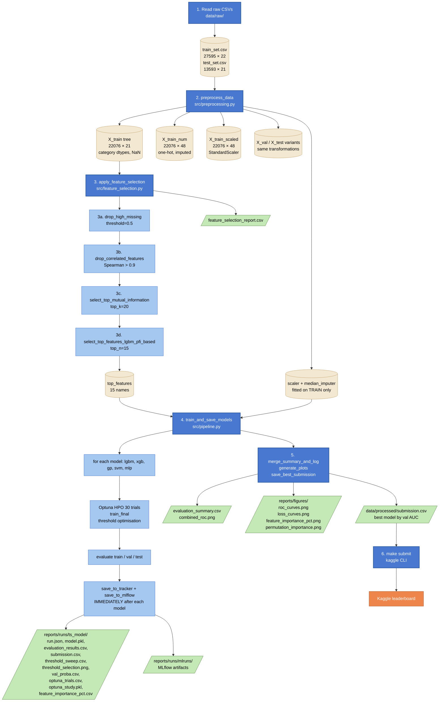

# Data Flow Schema

> Last updated: 10-04-2026

End-to-end data flow for a single `make pipeline` execution. Each stage is numbered;
the table below documents what runs, what comes in, what goes out, and what files
land on disk.

---

## Mermaid diagram

---

## Stage table

| #   | Stage                            | Module / function                                                         | Input                                                                         | Output                                                                                                                          | Files written                                                                                                                                                                                                                                                            |
| --- | -------------------------------- | ------------------------------------------------------------------------- | ----------------------------------------------------------------------------- | ------------------------------------------------------------------------------------------------------------------------------- | ------------------------------------------------------------------------------------------------------------------------------------------------------------------------------------------------------------------------------------------------------------------------ |
| 1   | Read raw CSVs                    | `pd.read_csv` inside `preprocessing.py`                                   | `data/raw/train_set.csv` (27,595 × 22), `data/raw/test_set.csv` (13,593 × 21) | Two raw `DataFrame` objects in memory                                                                                           | —                                                                                                                                                                                                                                                                        |
| 2   | Preprocess (single entry)        | `preprocess_data()` in `src/preprocessing.py`                             | The two raw DataFrames                                                        | `ProcessedData` container with **9 DataFrames** (3 variants × 3 splits) + `y_train`, `y_val`, fitted `scaler`, `median_imputer` | —                                                                                                                                                                                                                                                                        |
| 2a  | Tree variant                     | `build_features()`                                                        | raw DataFrame                                                                 | `X_train` (22,076 × 21), `X_val` (5,519 × 21), `X_test` (13,593 × 21) — **category dtypes, NaN preserved**                      | —                                                                                                                                                                                                                                                                        |
| 2b  | Numeric variant                  | `_to_numeric()` (one-hot + median impute, fit on TRAIN)                   | tree variant                                                                  | `X_train_num` (22,076 × 48), `X_val_num`, `X_test_num` — **float32, no NaN**                                                    | —                                                                                                                                                                                                                                                                        |
| 2c  | Scaled variant                   | `_scale()` with `StandardScaler` (fit on TRAIN only)                      | numeric variant                                                               | `X_train_scaled` (22,076 × 48), `X_val_scaled`, `X_test_scaled` — **mean 0, std 1**                                             | —                                                                                                                                                                                                                                                                        |
| 3   | Feature selection (4 stages)     | `apply_feature_selection()` in `src/pipeline.py`                          | `ProcessedData` (uses `X_train` tree variant)                                 | filtered `ProcessedData` (all variants pruned) + `top_features` list                                                            | `reports/runs/feature_selection_report.csv`                                                                                                                                                                                                                              |
| 3a  | Drop high-missing features       | `drop_high_missing(threshold=0.5)`                                        | 21 features                                                                   | ~20 features (drops `pdays` at 96% NaN)                                                                                         | —                                                                                                                                                                                                                                                                        |
| 3b  | Drop correlated features         | `drop_correlated_features(threshold=0.9, method="spearman")`              | output of 3a                                                                  | ~17 features (drops macro-economic dupes like `nr.employed` correlated with `euribor3m`)                                        | —                                                                                                                                                                                                                                                                        |
| 3c  | Top-K by Mutual Information      | `select_top_mutual_information(top_k=20)`                                 | output of 3b                                                                  | min(K, remaining) features                                                                                                      | —                                                                                                                                                                                                                                                                        |
| 3d  | Top-N by LightGBM PFI            | `select_top_features_lgbm_pfi_based(top_n=15)`                            | output of 3c                                                                  | **15 features** (final list)                                                                                                    | —                                                                                                                                                                                                                                                                        |
| 4   | Train + save per model           | `train_and_save_models()` in `src/pipeline.py`                            | filtered `ProcessedData` + tracker                                            | List of 5 result dicts (one per model)                                                                                          | `reports/runs/<ts>_<model>/` (×5, see 4d)                                                                                                                                                                                                                                |
| 4a  | Pick model + select data variant | `_data_map[spec["data"]]`                                                 | model name + `ProcessedData`                                                  | `(X_train, X_val, X_test)` of the right variant (tree or scaled)                                                                | —                                                                                                                                                                                                                                                                        |
| 4b  | HPO + final fit                  | `train_lgbm` / `train_xgb` / `train_gp` / `train_svm` / `train_mlp`       | train + val splits                                                            | fitted model, `val_proba`, `train_proba`, `test_preds`, optuna `study`, threshold info                                          | —                                                                                                                                                                                                                                                                        |
| 4c  | Evaluate model                   | `evaluate_model()` + `build_run_metrics()`                                | `result` dict + `y_train`, `y_val`                                            | `model_eval` DataFrame (3 rows) + `run_metrics` dict (16 metrics)                                                               | —                                                                                                                                                                                                                                                                        |
| 4d  | Save IMMEDIATELY after training  | `save_to_tracker()` + `save_to_mlflow()`                                  | `result`, `run_metrics`, `model_eval`                                         | written to disk in `reports/runs/<ts>_<model>/`                                                                                 | `run.json`, `evaluation_results.csv`, `submission.csv`, `model.pkl`, `threshold_sweep.csv`, `threshold_selection.png`, `val_proba.csv`, `optuna_trials.csv`, `optuna_study.pkl`, `feature_importance_pct.csv` (tree only)                                                |
| 5   | Cross-model aggregation          | `merge_summary_and_log()` + `generate_plots()` + `save_best_submission()` | list of all `trained` results                                                 | unified summary, plots, best model copy                                                                                         | `reports/runs/evaluation_summary.csv`, `reports/runs/combined_roc.png`, `reports/figures/roc_curves.png`, `reports/figures/loss_curves.png`, `reports/figures/feature_importance_pct.png`, `reports/figures/permutation_importance.png`, `data/processed/submission.csv` |
| 6   | Submit to Kaggle                 | `make submit` (or `make submit RUN=<run_dir>`)                            | `data/processed/submission.csv` (or per-model run)                            | Kaggle leaderboard score                                                                                                        | —                                                                                                                                                                                                                                                                        |

---

## Key design properties

1. **Single source of truth for transformations**: all imputation, encoding, and scaling
   happens in `preprocess_data()`. Models receive ready-to-use DataFrames.
2. **No data leakage**: medians and the StandardScaler are fit on **TRAIN only** then
   applied to val and test.
3. **Incremental saving**: each model's artifacts land on disk **immediately** after that
   model finishes (stage 4d). If model 5 of 5 crashes, models 1–4 are already safe.
4. **Multiple variants from one CSV read**: tree, numeric, and scaled variants are built
   in one pass — no redundant disk I/O.
5. **Feature selection report**: stage 3 produces a per-feature CSV showing which
   filter killed each rejected feature and why (see `docs/feature_selection.md`).

---

## Where to find what

| You want…                                                           | Look at                                                    |
| ------------------------------------------------------------------- | ---------------------------------------------------------- |
| Final selected features and why others were dropped                 | `reports/runs/feature_selection_report.csv`                |
| One model's metrics (run.json)                                      | `reports/runs/<ts>_<model>/run.json`                       |
| One model's threshold sweep (acc, recall, F1, Youden per threshold) | `reports/runs/<ts>_<model>/threshold_sweep.csv`            |
| Visual: where the threshold was selected                            | `reports/runs/<ts>_<model>/threshold_selection.png`        |
| All models × all splits in one table                                | `reports/runs/evaluation_summary.csv`                      |
| ROC of all historical runs in one plot                              | `reports/runs/combined_roc.png`                            |
| MLflow UI for cross-run exploration                                 | `uv run mlflow ui --backend-store-uri reports/runs/mlruns` |
| Best model's submission for Kaggle                                  | `data/processed/submission.csv`                            |
| Per-model submission (incl. non-best)                               | `reports/runs/<ts>_<model>/submission.csv`                 |
