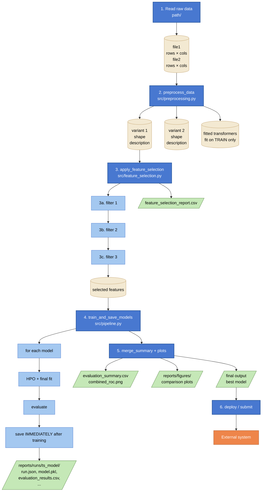

# Data Flow Schema (template)

> Last updated: DD-MM-YYYY

End-to-end data flow for a single `<entry-point command>` execution.
Each stage is numbered; the table below documents what runs, what comes in,
what goes out, and what files land on disk.

---

## How to use this template

1. Copy this file to `docs/data-flow-schema.md` in your project.
2. Update `> Last updated: DD-MM-YYYY` (day-month-year format).
3. Fill in the Mermaid diagram — one node per stage, one edge per data flow.
   Use the colour classes at the bottom: `stage`, `substage`, `data`, `file`, `external`.
4. Fill in the stage table — one row per stage, sub-stages indented (e.g. 3a, 3b).
   Columns: `#`, `Stage`, `Module / function`, `Input`, `Output`, `Files written`.
5. Keep the "Key design properties" and "Where to find what" sections — both help
   future readers understand the pipeline's guarantees and navigate outputs.

---

## Mermaid diagram

---

## Stage table

| # | Stage | Module / function | Input | Output | Files written |
|---|---|---|---|---|---|
| 1 | Read raw data | `...` | file paths | raw DataFrames | — |
| 2 | Preprocess (single entry) | `preprocess_data()` in `src/preprocessing.py` | raw DataFrames | typed container with all variants + fitted transformers | — |
| 2a | Variant 1 | `build_...()` | raw | variant 1 shape | — |
| 2b | Variant 2 | `_to_...()` | variant 1 | variant 2 shape | — |
| 2c | Fitted transformers | `fit_transform` on TRAIN only | variant 2 | scaler / imputer | — |
| 3 | Feature selection | `apply_feature_selection()` in `src/pipeline.py` | preprocessed data | filtered data + selected feature list | `feature_selection_report.csv` |
| 3a | Stage filter | `drop_...()` | ... | ... | — |
| 4 | Train + save per model | `train_and_save_models()` | filtered data + tracker | list of result dicts | `reports/runs/<ts>_<model>/` (per model) |
| 4a | Pick model + select data variant | `_data_map[spec["data"]]` | model name + data | data tuple | — |
| 4b | HPO + final fit | model-specific `train_*` | train+val splits | fitted model + metadata | — |
| 4c | Evaluate | `evaluate_model()` | result + y | metrics dict | — |
| 4d | Save IMMEDIATELY | `save_to_tracker()` + `save_to_mlflow()` | result + metrics | written to disk | `run.json`, `model.pkl`, ... |
| 5 | Cross-model aggregation | `merge_summary_and_log()` + `generate_plots()` | all trained results | unified summary + plots | `evaluation_summary.csv`, `combined_roc.png`, ... |
| 6 | Deploy / submit | `make submit` / custom script | final output | external system state change | — |

---

## Key design properties

1. **Single source of truth for transformations**: all preprocessing in one place.
   Models receive ready-to-use DataFrames.
2. **No data leakage**: all fitted transformers (scaler, imputer, encoder) are fit on
   **TRAIN only** then applied to val and test.
3. **Incremental saving**: each model's artifacts land on disk **immediately** after
   that model finishes. If model N of M crashes, models 1 … N−1 are safe.
4. **Multiple variants from one read**: all data variants built in one pass — no
   redundant disk I/O.
5. **Feature selection report**: per-feature CSV showing which filter killed each
   rejected feature and why.

---

## Where to find what

| You want… | Look at |
|---|---|
| Final selected features and why others were dropped | `reports/runs/feature_selection_report.csv` |
| One model's metrics | `reports/runs/<ts>_<model>/run.json` |
| One model's threshold sweep | `reports/runs/<ts>_<model>/threshold_sweep.csv` |
| Visual: where the threshold was selected | `reports/runs/<ts>_<model>/threshold_selection.png` |
| All models × all splits in one table | `reports/runs/evaluation_summary.csv` |
| ROC of all historical runs in one plot | `reports/runs/combined_roc.png` |
| MLflow UI for cross-run exploration | `uv run mlflow ui --backend-store-uri reports/runs/mlruns` |
| Final output for deployment / submission | `<path to best output>` |
