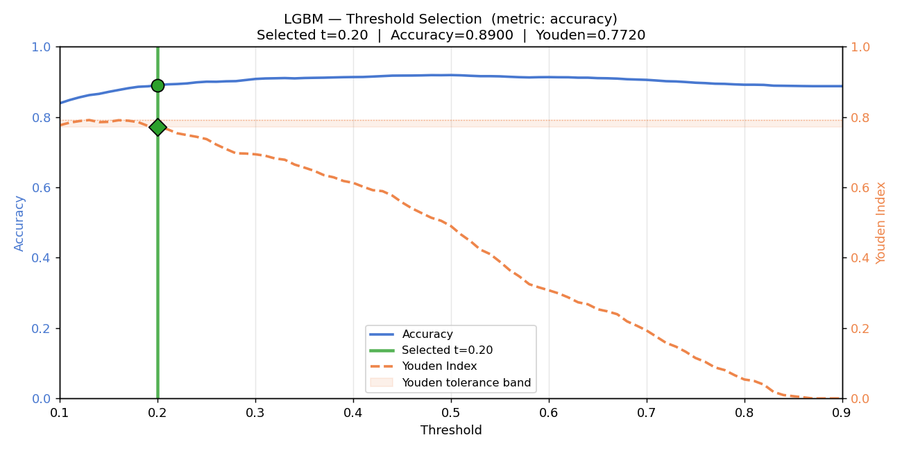
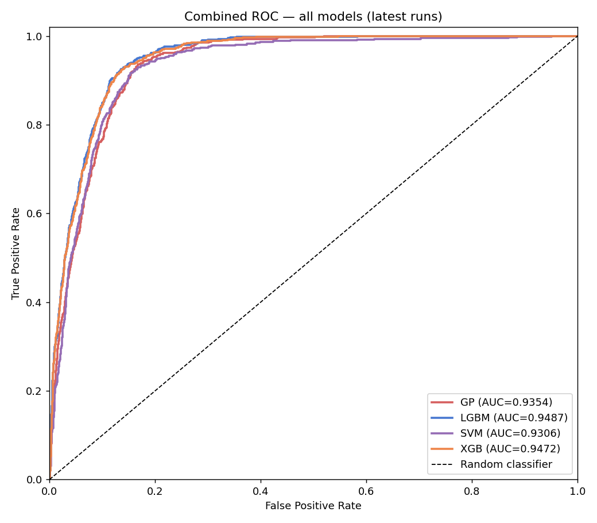
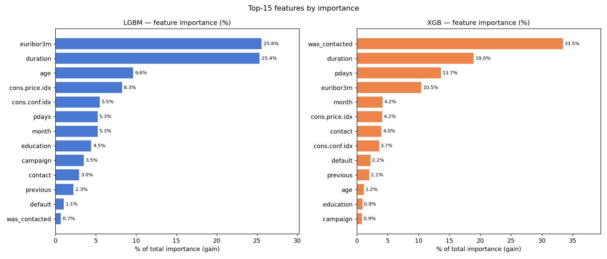
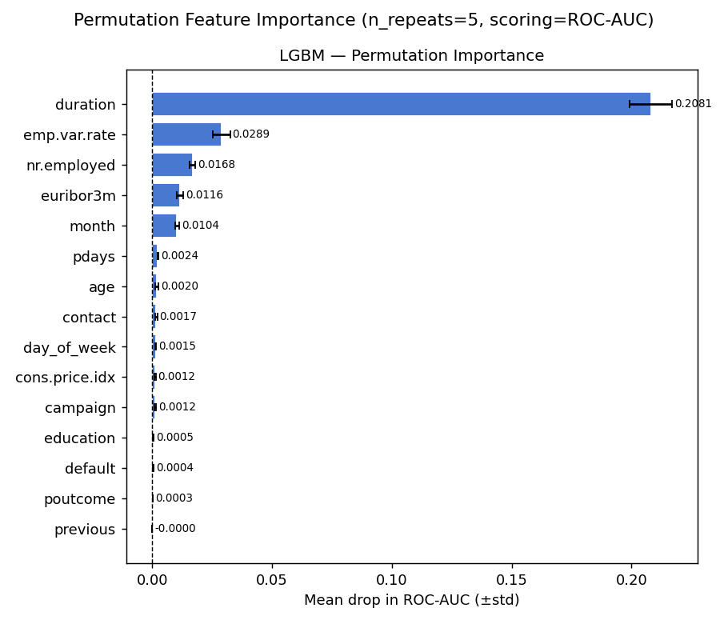

# Run Report — 2026-05-07 16:25

Auto-generated by `make pipeline` (`src/evaluations.py:write_run_report_md`).

## Best model

- **Model**: `lgbm`
- **Val AUC**: 0.9499
- **Val accuracy**: 0.8900

### Threshold selection — Youden Index

## Cross-model summary

| model   |   threshold |   val_roc_auc |   train_roc_auc |   val_gini |   train_gini |   val_ks_statistic |   train_ks_statistic |   val_pr_auc |   train_pr_auc |   val_accuracy |   train_accuracy |   val_precision |   train_precision |   val_recall |   train_recall |   val_f1 |   train_f1 |   val_n_samples |   train_n_samples |   val_n_positive |   train_n_positive |   val_positive_rate |   train_positive_rate |   test_n_samples |   test_n_positive |   test_positive_rate |
|:--------|------------:|--------------:|----------------:|-----------:|-------------:|-------------------:|---------------------:|-------------:|---------------:|---------------:|-----------------:|----------------:|------------------:|-------------:|---------------:|---------:|-----------:|----------------:|------------------:|-----------------:|-------------------:|--------------------:|----------------------:|-----------------:|------------------:|---------------------:|
| gp      |      0.1400 |        0.9354 |          0.9386 |     0.8708 |       0.8772 |             0.7682 |               0.7516 |       0.6061 |         0.6233 |         0.8576 |           0.8599 |          0.4359 |            0.4388 |       0.9034 |         0.8820 |   0.5881 |     0.5860 |            5519 |             22076 |             1287 |               4989 |              0.2332 |                0.2260 |            13593 |              3096 |               0.2278 |
| lgbm    |      0.2000 |        0.9499 |          0.9571 |     0.8999 |       0.9142 |             0.7916 |               0.8001 |       0.6661 |         0.7255 |         0.8900 |           0.8975 |          0.5065 |            0.5265 |       0.8808 |         0.8820 |   0.6432 |     0.6593 |            5519 |             22076 |             1080 |               4158 |              0.1957 |                0.1883 |            13593 |              2605 |               0.1916 |
| svm     |      0.1100 |        0.9306 |          0.9277 |     0.8612 |       0.8553 |             0.7629 |               0.7389 |       0.5798 |         0.5942 |         0.8654 |           0.8665 |          0.4498 |            0.4503 |       0.8808 |         0.8497 |   0.5955 |     0.5886 |            5519 |             22076 |             1216 |               4684 |              0.2203 |                0.2122 |            13593 |              2934 |               0.2158 |
| xgb     |      0.2000 |        0.9486 |          0.9543 |     0.8972 |       0.9085 |             0.7864 |               0.7894 |       0.6632 |         0.7070 |         0.8873 |           0.8955 |          0.4995 |            0.5210 |       0.8776 |         0.8735 |   0.6367 |     0.6527 |            5519 |             22076 |             1091 |               4161 |              0.1977 |                0.1885 |            13593 |              2623 |               0.1930 |

## Combined ROC

## Feature importance (tree models)

## Permutation importance

## Feature selection

| feature              |   missing_pct |   mi_score |   max_corr_with_other | max_corr_partner     | stage1_missing   | stage2_correlation   | stage3_mi   | stage4_pfi   | dropped_at         | drop_reason                            | selected   |
|:---------------------|--------------:|-----------:|----------------------:|:---------------------|:-----------------|:---------------------|:------------|:-------------|:-------------------|:---------------------------------------|:-----------|
| duration             |             0 |     0.0781 |                0.0968 | nr.employed          | True             | True                 | True        | True         | selected           | nan                                    | True       |
| euribor3m            |             0 |     0.0722 |                0.9385 | emp.var.rate         | True             | True                 | True        | True         | selected           | nan                                    | True       |
| cons.conf.idx        |             0 |     0.0695 |                0.5533 | month_aug            | True             | True                 | True        | True         | selected           | nan                                    | True       |
| cons.price.idx       |             0 |     0.0688 |                0.6597 | emp.var.rate         | True             | True                 | True        | True         | selected           | nan                                    | True       |
| was_contacted        |             0 |     0.0319 |                0.949  | poutcome_success     | True             | True                 | True        | True         | selected           | nan                                    | True       |
| pdays                |             0 |     0.0266 |                0.3712 | poutcome_success     | True             | True                 | True        | True         | selected           | nan                                    | True       |
| previous             |             0 |     0.0219 |                0.9984 | poutcome_nonexistent | True             | True                 | True        | True         | selected           | nan                                    | True       |
| age                  |             0 |     0.0122 |                0.4547 | marital_single       | True             | True                 | True        | True         | selected           | nan                                    | True       |
| contact_telephone    |             0 |     0.0118 |                0.6568 | cons.price.idx       | True             | True                 | True        | True         | selected           | nan                                    | True       |
| month_mar            |             0 |     0.0077 |                0.1551 | nr.employed          | True             | True                 | True        | True         | selected           | nan                                    | True       |
| month_may            |             0 |     0.0062 |                0.4287 | nr.employed          | True             | True                 | True        | True         | selected           | nan                                    | True       |
| month_oct            |             0 |     0.0059 |                0.1946 | nr.employed          | True             | True                 | True        | True         | selected           | nan                                    | True       |
| education            |             0 |     0.0045 |                0.5323 | job_blue-collar      | True             | True                 | True        | True         | selected           | nan                                    | True       |
| default_unknown      |             0 |     0.0033 |                0.2145 | education            | True             | True                 | True        | True         | selected           | nan                                    | True       |
| campaign             |             0 |     0      |                0.1577 | emp.var.rate         | True             | True                 | True        | True         | selected           | nan                                    | True       |
| nr.employed          |             0 |     0.0626 |                0.9459 | emp.var.rate         | True             | False                | False       | False        | stage2_correlation | spearman corr=0.946 with emp.var.rate  | False      |
| emp.var.rate         |             0 |     0.0527 |                0.9459 | nr.employed          | True             | False                | False       | False        | stage2_correlation | spearman corr=0.946 with nr.employed   | False      |
| poutcome_success     |             0 |     0.0284 |                0.949  | was_contacted        | True             | False                | False       | False        | stage2_correlation | spearman corr=0.949 with was_contacted | False      |
| poutcome_nonexistent |             0 |     0.0167 |                0.9984 | previous             | True             | False                | False       | False        | stage2_correlation | spearman corr=0.998 with previous      | False      |
| job_services         |             0 |     0.0072 |                0.1787 | job_blue-collar      | True             | True                 | False       | False        | stage3_mi          | mi=0.0072 (below top-k)                | False      |
| marital_married      |             0 |     0.0055 |                0.779  | marital_single       | True             | True                 | True        | False        | stage4_pfi         | pfi below top-n                        | False      |
| month_sep            |             0 |     0.0039 |                0.2012 | nr.employed          | True             | True                 | False       | False        | stage3_mi          | mi=0.0039 (below top-k)                | False      |
| job_blue-collar      |             0 |     0.0032 |                0.5323 | education            | True             | True                 | True        | False        | stage4_pfi         | pfi below top-n                        | False      |
| day_of_week_wed      |             0 |     0.0032 |                0.2592 | day_of_week_thu      | True             | True                 | False       | False        | stage3_mi          | mi=0.0032 (below top-k)                | False      |
| month_aug            |             0 |     0.003  |                0.5533 | cons.conf.idx        | True             | True                 | False       | False        | stage3_mi          | mi=0.0030 (below top-k)                | False      |
| job_retired          |             0 |     0.0026 |                0.3125 | age                  | True             | True                 | False       | False        | stage3_mi          | mi=0.0026 (below top-k)                | False      |
| month_jul            |             0 |     0.0021 |                0.438  | emp.var.rate         | True             | True                 | False       | False        | stage3_mi          | mi=0.0021 (below top-k)                | False      |
| job_unemployed       |             0 |     0.002  |                0.0834 | job_blue-collar      | True             | True                 | False       | False        | stage3_mi          | mi=0.0020 (below top-k)                | False      |
| day_of_week_thu      |             0 |     0.0017 |                0.2614 | day_of_week_mon      | True             | True                 | False       | False        | stage3_mi          | mi=0.0017 (below top-k)                | False      |
| job_technician       |             0 |     0.0016 |                0.2368 | job_blue-collar      | True             | True                 | False       | False        | stage3_mi          | mi=0.0016 (below top-k)                | False      |
| job_management       |             0 |     0.0009 |                0.2025 | education            | True             | True                 | False       | False        | stage3_mi          | mi=0.0009 (below top-k)                | False      |
| month_jun            |             0 |     0.0009 |                0.4584 | cons.price.idx       | True             | True                 | False       | False        | stage3_mi          | mi=0.0009 (below top-k)                | False      |
| marital_single       |             0 |     0.0008 |                0.779  | marital_married      | True             | True                 | False       | False        | stage3_mi          | mi=0.0008 (below top-k)                | False      |
| day_of_week_tue      |             0 |     0.0007 |                0.2529 | day_of_week_thu      | True             | True                 | True        | False        | stage4_pfi         | pfi below top-n                        | False      |
| job_entrepreneur     |             0 |     0.0003 |                0.1015 | job_blue-collar      | True             | True                 | False       | False        | stage3_mi          | mi=0.0003 (below top-k)                | False      |
| job_student          |             0 |     0.0001 |                0.2214 | marital_single       | True             | True                 | False       | False        | stage3_mi          | mi=0.0001 (below top-k)                | False      |
| housing_yes          |             0 |     0.0001 |                0.1696 | housing_unknown      | True             | True                 | True        | False        | stage4_pfi         | pfi below top-n                        | False      |
| job_housemaid        |             0 |     0      |                0.1207 | education            | True             | True                 | False       | False        | stage3_mi          | mi=0.0000 (below top-k)                | False      |
| job_self-employed    |             0 |     0      |                0.1031 | job_blue-collar      | True             | True                 | False       | False        | stage3_mi          | mi=0.0000 (below top-k)                | False      |
| job_unknown          |             0 |     0      |                0.051  | default_unknown      | True             | True                 | False       | False        | stage3_mi          | mi=0.0000 (below top-k)                | False      |
| marital_unknown      |             0 |     0      |                0.0544 | marital_married      | True             | True                 | False       | False        | stage3_mi          | mi=0.0000 (below top-k)                | False      |
| default_yes          |             0 |     0      |                0.0301 | job_unemployed       | True             | True                 | False       | False        | stage3_mi          | mi=0.0000 (below top-k)                | False      |
| housing_unknown      |             0 |     0      |                1      | loan_unknown         | True             | False                | False       | False        | stage2_correlation | spearman corr=1.000 with loan_unknown  | False      |
| loan_unknown         |             0 |     0      |                1      | housing_unknown      | True             | True                 | False       | False        | stage3_mi          | mi=0.0000 (below top-k)                | False      |
| loan_yes             |             0 |     0      |                0.0683 | housing_unknown      | True             | True                 | False       | False        | stage3_mi          | mi=0.0000 (below top-k)                | False      |
| month_dec            |             0 |     0      |                0.1116 | emp.var.rate         | True             | True                 | True        | False        | stage4_pfi         | pfi below top-n                        | False      |
| month_nov            |             0 |     0      |                0.2306 | month_may            | True             | True                 | False       | False        | stage3_mi          | mi=0.0000 (below top-k)                | False      |
| day_of_week_mon      |             0 |     0      |                0.2614 | day_of_week_thu      | True             | True                 | False       | False        | stage3_mi          | mi=0.0000 (below top-k)                | False      |
